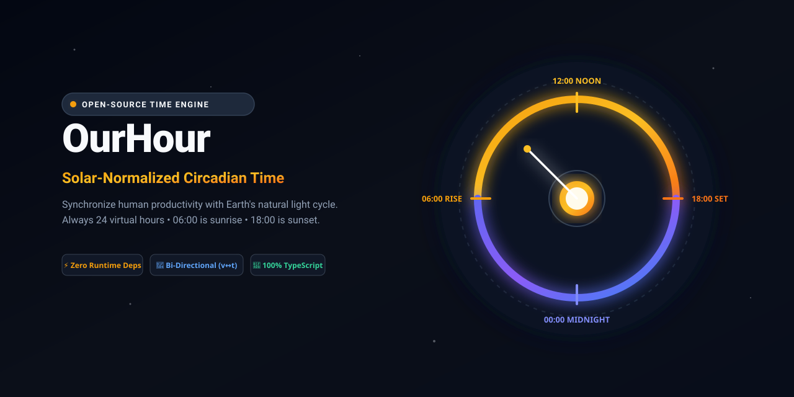
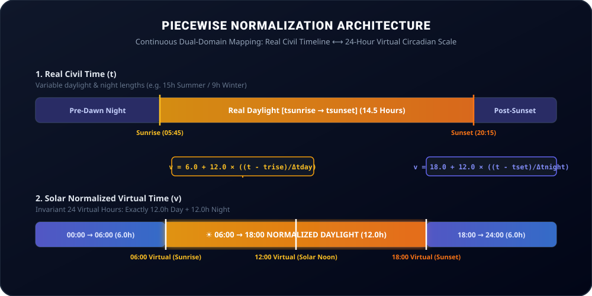

<div align="center">



<br/>

# OurHour ☀️🕒

**The Solar-Normalized Circadian Time Engine &amp; Productivity Suite.**

*Synchronize human productivity with Earth's natural light cycle.*

[](https://github.com/FranciscoReyne/Our-Hour/actions)
[](https://opensource.org/licenses/Apache-2.0)
[](https://www.typescriptlang.org/)
[](#features)
[](CONTRIBUTING.md)

[**Live Interactive Demo**](https://franciscoreyne.github.io/Our-Hour) • [**Developer Docs**](developer.html) • [**SDK Quickstart**](#typescript--javascript-sdk) • [**Mathematical Model**](#mathematical-piecewise-model) • [**Calendar Sync**](#productivity--calendar-export)

</div>

---

## 🌟 What is OurHour?

Standard civil clocks are static: a 24-hour cycle where `08:00 AM` could be pitch-black darkness during a Nordic winter or blazing sunlight in equatorial summer. 

**OurHour** introduces **Solar-Normalized Virtual Time**: a heliocentric temporal framework where every solar day has **exactly 24 virtual hours**:
* 🌅 **06:00 Virtual** is **always** sunrise.
* ☀️ **12:00 Virtual** is **always** solar noon (sun at its zenith).
* 🌇 **18:00 Virtual** is **always** sunset.
* 🌌 **00:00 Virtual** is **always** solar nadir (midpoint of night).

During long summer days, daylight hours gracefully dilate; during short winter days, they compress. Your biological clock, focus blocks, and circadian habits remain invariant and synchronized with nature regardless of season, latitude, or timezone.

---

## ✨ Key Features

- ⚡ **Zero External Runtime Dependencies**: Pure TypeScript ephemeris algorithms computing high-precision solar coordinates, transit times, and twilights offline.
- 🔄 **Bi-Directional Invertibility**: Exact piecewise continuous transformations ($t \leftrightarrow v$) preserving timestamps to sub-millisecond precision.
- ⌚ **Luxury Titanium OLED Smartwatch HUD**: Pixel-perfect digital squircle chassis with real-time solar elevation gauge, twilight rings, and instant landmark jump buttons.
- 🌐 **Global & High-Latitude Resilience**: Continuous mathematical handling for Equators, Southern/Northern Hemispheres, Daylight Saving Time (DST), and Arctic Midnight Sun / Polar Night.
- 📅 **Circadian Productivity & .ics Export**: Schedule tasks in virtual time and export directly to Google Calendar, Apple Calendar, and Outlook with accurate civil times.
- 🎛️ **Interactive 24-Hour Bezel Scrubber**: Tactile time scrubbing with live dual-clock ticker, solar altitude angle, and dilation factor readouts.

---

## 📐 Mathematical Piecewise Model

<div align="center">
  
</div>

### 1. Daylight Phase ($t \in [t_{\text{sunrise}}, t_{\text{sunset}}]$)
Maps the interval $[t_{\text{sunrise}}, t_{\text{sunset}}]$ linearly to virtual hours $[6.0, 18.0]$:

$$v(t) = 6.0 + \left(\frac{t - t_{\text{sunrise}}}{t_{\text{sunset}} - t_{\text{sunrise}}}\right) \times 12.0$$

*Time Dilation Rate*:

$$k_{\text{day}} = \frac{12.0}{\Delta t_{\text{daylight\_hours}}}$$

* $k < 1.0$: Virtual time runs slower (e.g. 16h summer day $\to$ 1 real hour = 0.75 virtual hours).
* $k > 1.0$: Virtual time runs faster (e.g. 8h winter day $\to$ 1 real hour = 1.50 virtual hours).

### 2. Night Phase ($t \in [t_{\text{sunset}}, t_{\text{next\_sunrise}}]$)
Maps the interval $[t_{\text{sunset}}, t_{\text{next\_sunrise}}]$ linearly to virtual hours $[18.0, 30.0) \equiv [18.0, 6.0)$:

$$v(t) = \left(18.0 + \left(\frac{t - t_{\text{sunset}}}{t_{\text{next\_sunrise}} - t_{\text{sunset}}}\right) \times 12.0\right) \bmod 24.0$$

### 3. Inverse Transformation ($v \to t$)
Given a desired virtual time $v \in [0.0, 24.0)$:

$$t(v) = 
\begin{cases} 
t_{\text{sunrise}} + \left(\frac{v - 6.0}{12.0}\right) (t_{\text{sunset}} - t_{\text{sunrise}}) & \text{if } 6.0 \le v \le 18.0 \\
t_{\text{sunset}} + \left(\frac{v - 18.0}{12.0}\right) (t_{\text{next\_sunrise}} - t_{\text{sunset}}) & \text{if } v > 18.0 \\
t_{\text{prev\_sunset}} + \left(\frac{v + 6.0}{12.0}\right) (t_{\text{sunrise}} - t_{\text{prev\_sunset}}) & \text{if } v < 6.0
\end{cases}$$

---

## 🎛️ Interactive Smartwatch & Controls

### ⌨️ Keyboard Shortcuts
| Key | Action | Description |
|---|---|---|
| <kbd>Space</kbd> | Toggle Simulation / Live | Switch between real-time tracking and manual time travel |
| <kbd>←</kbd> / <kbd>→</kbd> | Step $\pm 10$ Minutes | Fine-tune civil time forward or backward |
| <kbd>Shift</kbd> + <kbd>←</kbd> / <kbd>→</kbd> | Step $\pm 60$ Minutes | Fast-forward or rewind by 1 hour |

### 🧭 1-Click Solar Landmark Jumps
- **`06:00v` Sunrise**: Sun crosses the horizon (Civil dawn transition).
- **`12:00v` Zenith**: Solar noon (Sun at maximum daily elevation).
- **`18:00v` Sunset**: Sun sets below horizon (Civil dusk transition).
- **`00:00v` Nadir**: Solar midnight (Sun at deepest point below horizon).
- **`LIVE` Return**: Instantly snaps back to current live civil time.

### 🌍 Global Astronomical Locations Supported
Pre-configured with high-precision coordinates and IANA timezones:
- 🇨🇱 **Santiago** (`-33.4489°, -70.6693°`)
- 🇦🇷 **Buenos Aires** (`-34.6037°, -58.3816°`)
- 🇧🇷 **São Paulo** (`-23.5505°, -46.6333°`)
- 🇺🇸 **New York** (`40.7128°, -74.0060°`)
- 🇬🇧 **London** (`51.5074°, -0.1278°`)
- 🇪🇸 **Madrid** (`40.4168°, -3.7038°`)
- 🇯🇵 **Tokyo** (`35.6762°, 139.6503°`)
- 🇦🇺 **Sydney** (`-33.8688°, 151.2093°`)
- 🇳🇴 **Tromsø** (`69.6492°, 18.9553°` - Arctic Midnight Sun / Polar Night)
- 🇮🇸 **Reykjavik** (`64.1466°, -21.9426°`)

---

## 💻 TypeScript / JavaScript SDK

### Installation

```bash
# Clone the repository
git clone https://github.com/FranciscoReyne/Our-Hour.git
cd Our-Hour

# Install dependencies
npm install
```

### Basic Usage

```typescript
import { NormalizedTimeEngine } from './src/core';

const engine = new NormalizedTimeEngine();

const santiago = {
  latitude: -33.4489,
  longitude: -70.6693,
  name: 'Santiago',
  country: 'Chile',
  timezone: 'America/Santiago'
};

// 1. Convert Real Civil Date -> Normalized Virtual Time
const virtual = engine.toVirtualTime(new Date(), santiago);

console.log(virtual.virtualTimeStr);  // "08:32:15"
console.log(virtual.phase);           // "DAY"
console.log(virtual.dilationFactor);  // 1.18x
console.log(virtual.solarAltitudeDeg);// 34.2°

// 2. Convert Virtual Hour -> Real Civil Timestamp
const deepWorkStartVirtual = 8.0; // 08:00 Virtual (2h post-sunrise)
const realCivilDate = engine.toRealTime(deepWorkStartVirtual, new Date(), santiago);

console.log(realCivilDate.toLocaleTimeString()); // e.g. "09:14:00 AM"
```

---

## 📅 Productivity & Calendar Export

Create circadian habits and time blocks that automatically flex with the seasons:

```typescript
import { Scheduler, ScheduleTask } from './src/core';

const scheduler = new Scheduler(engine);

const tasks: ScheduleTask[] = [
  {
    id: 'deep-work',
    title: 'Deep Architecture Focus',
    category: 'deep_work',
    virtualStart: 8.0,  // 08:00 Virtual (2h after sunrise)
    virtualEnd: 11.5,  // 11:30 Virtual
    color: '#F59E0B',
    completed: false
  }
];

// Resolves exact civil times for today in Santiago
const resolved = scheduler.resolveScheduleForDate(tasks, new Date(), santiago);

// Generate standard iCalendar (.ics) string for 1-click import
const icsContent = scheduler.generateICalendar(resolved, santiago);
```

---

## 🧪 Comprehensive Test Suite

Run the automated mathematical proofs and edge-case verification tests:

```bash
npm run test
```

Verifies:
* ✅ **Sunrise Invariance**: Real Sunrise $\equiv 06:00:00$ Virtual across all latitudes.
* ✅ **Sunset Invariance**: Real Sunset $\equiv 18:00:00$ Virtual across all latitudes.
* ✅ **Solar Noon Invariance**: Real Solar Noon $\equiv 12:00:00$ Virtual.
* ✅ **Solar Nadir Invariance**: Real Solar Nadir $\equiv 00:00:00$ Virtual.
* ✅ **Piecewise Invertibility**: Roundtrip precision ($t \to v \to t$) within $< 10$ milliseconds.
* ✅ **Polar Resilience**: Extreme latitude support for Midnight Sun & Polar Night (Tromsø, Svalbard).
* ✅ **DOM & Lifecycle**: 100% test passing across 5 test suites.

---

## 🚀 Running the Interactive Web App Locally

```bash
# Start local dev server
npm run dev

# Build production bundle
npm run build

# Preview build locally
npm run preview
```

Open [http://localhost:3000](http://localhost:3000) to view the live celestial HUD.

---

## 🗺️ Roadmap

- [x] High-precision zero-dependency astronomical solar ephemeris
- [x] Piecewise continuous virtual time normalization engine
- [x] Dual-clock live canvas dial & 24h scrubber simulation
- [x] Virtual time-blocking scheduler with `.ics` calendar sync
- [x] Polar summer/winter extreme latitude handler
- [ ] Mobile Widget (iOS / Android / watchOS)
- [ ] Raycast & Alfred Extension for instant virtual time lookup
- [ ] AI-Powered Circadian Energy Optimization Planner

---

## 🤝 Contributing

Contributions, issues, and feature requests are warmly welcomed! Please check the [Contributing Guide](CONTRIBUTING.md) and our [Code of Conduct](CODE_OF_CONDUCT.md).

1. Fork the Project
2. Create your Feature Branch (`git checkout -b feature/CelestialWidget`)
3. Commit your Changes (`git commit -m 'Add CelestialWidget'`)
4. Push to the Branch (`git push origin feature/CelestialWidget`)
5. Open a Pull Request

---

## 📜 License
 
Distributed under the **Apache License 2.0**. See [`LICENSE`](LICENSE) for more information.

---

<div align="center">
  <sub>Built with ☀️ by <strong>Francisco Reyne</strong> &amp; OurHour Open Source Contributors.</sub>
</div>
>>>>>>> 5f16708 (feat: initial release of Our-Hour solar-normalized circadian time engine)
